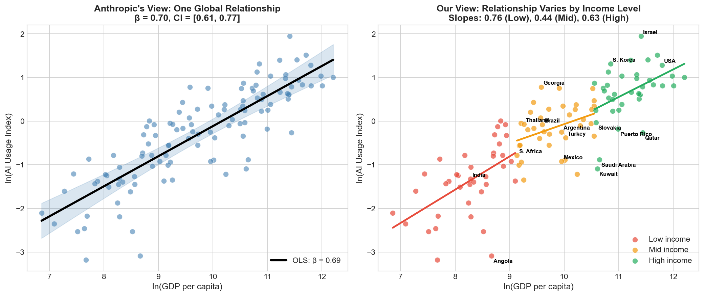
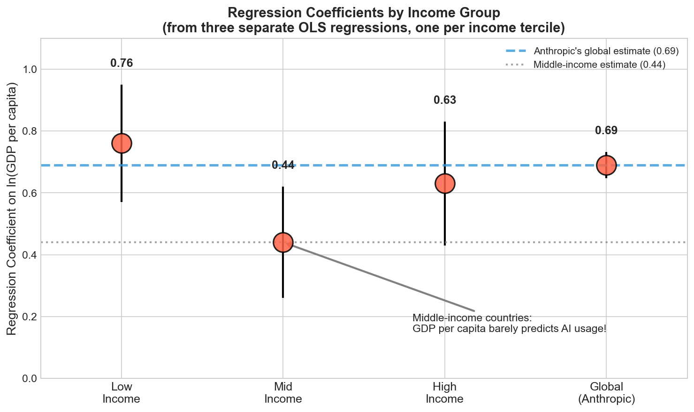
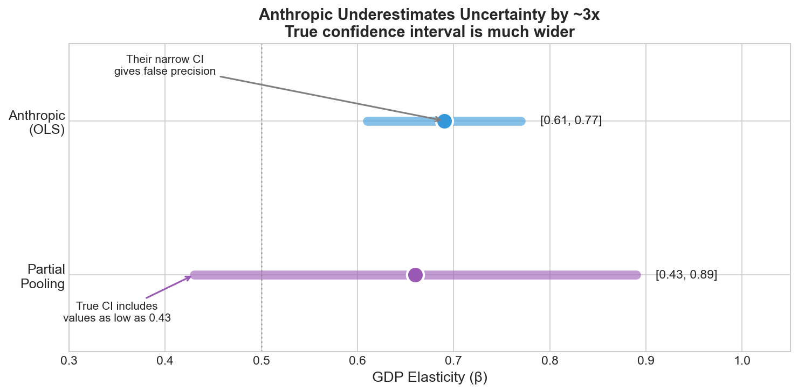
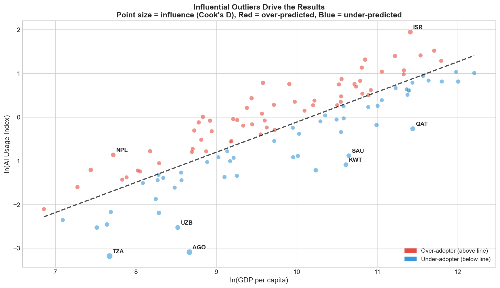
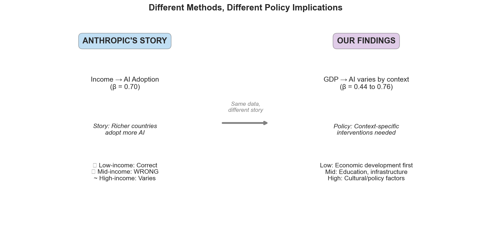

# Does GDP Really Predict AI Adoption? A Closer Look at Anthropic's Data

**Ilan Strauss | AI Disclosures Project | January 2026**

---

Anthropic recently released their [Economic Index January 2026 Report](https://www.anthropic.com/research/anthropic-economic-index-january-2026-report), claiming that national income strongly predicts AI adoption. Their headline finding:

> "At the country level, a 1% increase in GDP per capita is associated with a 0.7% increase in Claude usage per capita."

## Why This Claim Matters

This isn't just an academic finding—it shapes how we think about AI's global future. Anthropic knows this. As Peter McCrory, Anthropic's head of economics, told the *Financial Times*:

> "If the productivity gains...materialise in places that have early adoption, you could see a divergence in living standards."

If GDP truly drives AI adoption with a 0.7 elasticity, the implications are profound:

**For global inequality**: AI benefits would naturally flow to rich countries, compounding existing advantages. Poor countries would need to get richer *first* before they could benefit from AI—a development ladder where AI sits at the top. And as McCrory warns, this could mean **diverging living standards**—the rich get richer, AI-powered productivity compounds their advantage.

**For policy**: Governments wanting to boost AI adoption should focus on economic growth. Education programs, digital infrastructure, language access? Secondary concerns. GDP is the bottleneck.

**For AI companies**: Emerging markets are a waiting game. Don't invest heavily in localization or access programs—just wait for GDP to rise and adoption will follow automatically.

**For convergence debates**: If the relationship is strong and universal, we'd expect AI adoption gaps to mirror income gaps indefinitely. The digital divide becomes a permanent feature of the global economy.

## The Problem

This sounds like a clean story: richer countries use more AI. But when we dug into [their publicly available data](https://huggingface.co/datasets/Anthropic/EconomicIndex), we found that this simple narrative masks important complexity—complexity that matters for policy.

**What if the 0.7 elasticity doesn't hold everywhere?** What if middle-income countries—home to most of the world's population—show a much weaker relationship? That would fundamentally change the policy prescription: instead of waiting for GDP growth, these countries could accelerate AI adoption through education, infrastructure, and language access.

That's exactly what we found.

**TL;DR**: Using the same data but better statistical methods, we find:
1. The GDP-AI relationship varies dramatically by income level (from 0.44 to 0.76)
2. For middle-income countries, GDP barely predicts AI usage
3. Anthropic's confidence intervals are ~3x too narrow
4. A handful of outlier countries drive their results

---

## Their View vs. Our View

The left panel shows Anthropic's approach: fit one line through all countries. The right panel shows what happens when we allow the relationship to vary by income level. **The slopes are dramatically different.**

---

## The Middle-Income AI Trap

Here's the key finding: **the GDP-AI relationship is weakest in middle-income countries** (β = 0.44 vs. 0.76 for low-income and 0.63 for high-income).

What does this mean?

- **Low-income countries**: GDP growth IS strongly associated with AI adoption. Economic development may be a necessary condition.
- **Middle-income countries**: GDP barely matters. Other factors dominate—education, English proficiency, tech infrastructure, regulatory environment.
- **High-income countries**: Huge variation. Israel is a massive over-adopter (7x expected usage), while Gulf states lag despite their wealth.

**The policy implication is stark**: Telling middle-income countries like Brazil, Mexico, or Thailand to "grow GDP to get AI adoption" misses the point. They need to focus on education and infrastructure.

---

## They're Overconfident

Anthropic's narrow confidence interval [0.61, 0.77] suggests precision. But this ignores a fundamental issue: **the relationship varies across country groups**.

When we use partial pooling—a statistical technique that properly accounts for group-level variation—the confidence interval widens to [0.43, 0.89]. That's almost **3x wider**.

Why does this matter? Their interval excludes 0.44 (the middle-income slope) as implausible. Our interval includes it. They're confident in a relationship that doesn't hold for a huge chunk of the world's population.

### The Technical Issue (for the stats nerds)

OLS standard errors assume all observations are independent with a constant relationship. When slopes vary by group, the true variance of the pooled estimate is:

$$\text{Var}(\hat{\beta}_{pooled}) = \text{Var}(\hat{\beta}|slopes) + \text{Var}(slopes)$$

OLS only captures the first term. It completely misses the second—the between-group variance in slopes. This is the "Moulton problem" well-known in economics (Moulton 1990, Bertrand et al. 2004).

---

## Outliers Drive the Results

A handful of unusual countries have outsized influence on the slope:

| Country | Issue | Effect |
|---------|-------|--------|
| **Israel** | Massive over-adopter (7x expected) | Pulls slope UP |
| **Tanzania, Angola** | Severe under-adopters | Pull slope UP |
| **Qatar, Kuwait, Saudi Arabia** | Rich but low AI usage | Pull slope DOWN |

Remove Israel and the slope drops. Remove the African outliers and it changes again. The "global relationship" is really a compromise driven by ~6 unusual countries.

---

## Policy Implications: Same Data, Different Story

**Anthropic's implicit recommendation**: Grow GDP → Get AI adoption

**Our correction**:
- **Low-income countries**: Yes, economic development helps
- **Middle-income countries**: GDP growth alone won't close the AI gap. Focus on education, digital literacy, English proficiency, tech infrastructure
- **High-income countries**: Cultural, linguistic, and policy factors dominate. Israel's success vs. Gulf states' lag shows GDP isn't destiny

---

## Why Partial Pooling?

We use partial pooling (hierarchical/multilevel models) because it's theoretically superior for grouped data. This isn't a new idea:

- **Stein (1956)** proved that when estimating multiple group means, shrinkage estimators always beat treating groups as independent
- **Gelman & Hill (2007)** and **McElreath (2020)** show partial pooling consistently outperforms both "one size fits all" and "every group is different" approaches
- **The James-Stein estimator** demonstrates that "borrowing strength" across groups reduces total error

Anthropic uses complete pooling—assuming all countries share the same relationship. This is both empirically wrong (slopes vary from 0.44 to 0.76) and theoretically suboptimal.

---

## Conclusion

Anthropic's Economic Index is valuable data. But their analysis tells a simpler story than the data supports. The GDP-AI relationship:
- Is weaker than claimed overall
- Varies dramatically by development level
- Is driven by outlier countries
- Has much higher uncertainty than reported

For policymakers, the takeaway is: **context matters**. The path to AI adoption for Brazil is different from Bangladesh is different from Belgium. One global elasticity can't capture that.

---

## Reproduce Our Analysis

All code and data: [github.com/IlanStrauss/anthropic-econ-critique](https://github.com/IlanStrauss/anthropic-econ-critique)

- `analysis_full.py` - Python (statsmodels)
- `analysis_brms.R` - R (brms for Bayesian analysis)

---

## References

1. Anthropic (2026). Economic Index January 2026 Report.
2. Gelman, A., & Hill, J. (2007). *Data Analysis Using Regression and Multilevel/Hierarchical Models*.
3. McElreath, R. (2020). *Statistical Rethinking* (2nd ed.).
4. Moulton, B.R. (1990). "An Illustration of a Pitfall in Estimating the Effects of Aggregate Variables on Micro Units." *Review of Economics and Statistics*.
5. Bertrand, M., Duflo, E., & Mullainathan, S. (2004). "How Much Should We Trust Differences-in-Differences Estimates?" *QJE*.

---

*Contact: ilan@aidisclosures.org*
