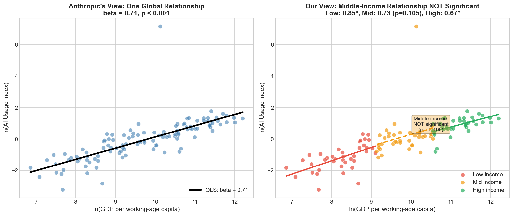
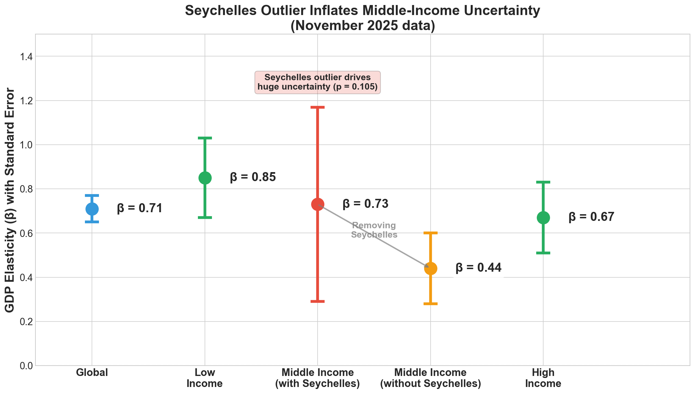

# Does GDP per Capita Really Predict AI Adoption? Adjusting Anthropic's Estimates
*Why Anthropic's data does not predict divergence between countries from global AI adoption but instead convergence*

**Ilan Strauss | [AI Disclosures Project](https://www.ssrc.org/programs/ai-disclosures-project/) | January 2026**

---

Anthropic's [Economic Index January 2026 Report](https://www.anthropic.com/research/anthropic-economic-index-january-2026-report) claims:

> "Worldwide, uneven adoption remains well-explained by GDP per capita."

> "At the country level, a 1% increase in GDP per capita[^2] is associated with a 0.7% increase in Claude usage per capita."

**Using their own data, however, we show this claim is not true for the middle-income group of countries, where much of the world's population resides. If anything, it points to convergence in AI adoption, not divergence.** It provides no evidence on the possibility for long-term divergences in economic growth between countries from AI investments.

*Note: Anthropic's research paper contains a number of important findings — on occupational exposure, task automation, and more. We focus here on just one claim: the GDP per capita relationship.*

## Why This Matters

The head of economics at Anthropic, Peter McCrory, told the [*Financial Times*](https://www.ft.com/content/3ad44e30-c738-4356-91fb-8bb2368685c4): "If the productivity gains...materialise in places that have early adoption, you could see a divergence in living standards." However, Anthropic's latest research does not provide much evidence (if any) on the question of whether AI will create more or less convergence in global income levels between countries.

1) Anthropic's cross-country regression, estimating how income level (GDP per capita) impacts AI adoption, does not by itself imply growing divergence in global living standards between countries. Impacts on *living standards* (i.e. convergence vs. divergence) from AI adoption cannot be estimated from AI adoption. This requires estimating the **second order effect** of how AI adoption impacts a country's productivity, which Anthropic does not do here.

2) Anthropic's AI Usage Index (AUI)[^1] measures **relative usage intensity** — how countries rank against each other in their usage of Claude — not absolute adoption levels. The estimated regression coefficients from the GDP per capita-AI Adoption relationship can only tell us that income levels predicts that certain countries use Claude more *relative to other countries*, but says nothing about whether that usage is economically meaningful at all. A country could rank highly on AUI while still having negligible actual AI adoption.

3) *Moreover, as we focus on in this note, Anthropic's data when analyzed properly shows more reason to predict convergence in AI adoption*: since **middle-income countries are adopting AI more than what their income level predicts**, when allowing for GDP per capita's impact on AI adoption to vary by a country's initial income level. In the November 2025 data, the middle-income relationship is highly uncertain (β = 0.73, SE = 0.44, p = 0.105) with a very poor fit (R² = 0.07) — GDP per capita explains almost nothing about AI adoption for these countries.

### Do not pool data: all countries are not alike
Anthropic uses GDP per capita to predict AI adoption. They "pool" across all countries, meaning they assume the relationship between how income level impacts AI adoption is the same everywhere — a single parameter represents the strength and nature of this relationship and applies equally to Nigeria and Norway alike. 

We reanalyzed Anthropic's [public data](https://huggingface.co/datasets/Anthropic/EconomicIndex), including both the November 2025 data used in their January 2026 report and an earlier August 2025 release. The 0.7 elasticity coefficient representing the impact that GDP per capita has on AI adoption does not hold universally across countries. Their analysis is [biased](https://rodorigo.wordpress.com/wp-content/uploads/2020/02/cheng-hsiao-analysis-of-panel-dataz-lib.org_.pdf) by assuming a single relationship when in fact different ones exist for different income-level groups.

We find **the relationship breaks down for middle-income countries**. In the November 2025 data (used in their report), the relationship is not statistically significant (β = 0.73, SE = 0.44, p = 0.105); in the August 2025 data, the relationship is weak (β = 0.44, SE = 0.18, p = 0.019). This matters because middle-income countries contain much of the world's population. For them, income level is a weak and uncertain predictor of AI adoption — and in fact they are adopting AI more than their wealth would predict.

The implication: middle-income countries like Brazil, Mexico, Thailand, and Malaysia do not need to wait for more GDP growth in order to get more AI adoption — and aren't. Selective investments in education, digital infrastructure, English proficiency, and regulatory environment may be driving greater adoption. These are actionable policy levers.

Elsewhere, Anthropic also finds that human education — the sophistication of user prompts — correlates with AI adoption. We focus on their GDP per capita claim, which drives the headline, but their education finding supports our argument: middle-income countries can invest in education, for example, rather than waiting to get richer in order to drive AI adoption.

---

## Results

### 1. The relationship varies by income level

**Figure 1** shows separate OLS regression lines by income tercile using Anthropic's November 2025 data. Left panel: with all countries. Right panel: excluding Seychelles.

**The key finding: one data anomaly is driving the high uncertainty in the middle-income relationship.** Seychelles has a usage index 488 times higher than the next highest middle-income country — almost certainly reflecting VPN/proxy traffic routed through this offshore jurisdiction rather than genuine local adoption. With Seychelles included (left panel), the middle-income relationship appears statistically insignificant (p = 0.105) with massive uncertainty (SE = 0.44). Without Seychelles (right panel), the relationship becomes significant but **weak** — the middle-income slope (β = 0.44) is much lower than the global slope (0.70).

This highlights two issues with Anthropic's analysis: (1) their usage data needs adjustment for VPN/proxy traffic to be meaningful for cross-country comparisons, and (2) even after removing the outlier, the GDP-AI adoption relationship is much weaker for middle-income countries than their pooled estimate suggests.

| Income Group | With Seychelles | Without Seychelles |
|--------------|-----------------|-------------------|
| **Middle income β** | 0.73 | **0.44** |
| **Std. Error** | 0.44 | **0.16** |
| **p-value** | 0.105 (not sig.) | **0.011** |
| **R²** | 0.07 | **0.17** |

Notably, the middle-income results **without Seychelles** (β = 0.44, SE = 0.16, p = 0.011) are nearly identical to an earlier August 2025 data release (β = 0.44, SE = 0.18, p = 0.019) — before Seychelles entered the dataset. The apparent "instability" between periods was entirely driven by this single VPN-related outlier.

**Figure 2** shows the regression coefficients (with standard errors) estimated from **separate OLS regressions** by income group using the November 2025 data. The middle-income coefficient has a much larger error bar, reflecting high uncertainty — the relationship is statistically indistinguishable from zero.

This matters because middle-income countries contain much of the world's population. For them, income level is a weak predictor of AI adoption — they are adopting AI beyond what their wealth would predict.

**Evidence from residuals:** We can verify this claim by examining prediction errors. Using Anthropic's own regression, middle-income countries have a median residual of +0.122 — meaning the typical middle-income country adopts about 13% more AI than predicted (e^0.122 ≈ 1.13). Nearly two-thirds (63%) of middle-income countries are above Anthropic's regression line.

| Income Group | Mean Residual | Median Residual | % Above Prediction |
|--------------|---------------|-----------------|-------------------|
| Low | -0.059 | +0.042 | 50.0% |
| High | -0.035 | -0.054 | 44.7% |

| Middle Income Group | With Seychelles | Without Seychelles |
|---------------------|-----------------|-------------------|
| Mean Residual | **+0.094** | -0.030 |
| Median Residual | **+0.122** | -0.063 |
| % Above Prediction | **63.2%** | 40.5% |

Our income-group-specific regressions also tell this story: the middle-income regression has both a lower slope (β = 0.44) and a higher intercept (-4.43 vs -7.01 for Anthropic's global model), meaning it predicts higher baseline adoption for middle-income countries at typical GDP levels. Our middle-income regression has R² = 0.14, confirming GDP per capita is a weak predictor for this group.

The implication: middle-income countries like Brazil, Mexico, Thailand, and Malaysia do not need to wait for more GDP growth in order to get more AI adoption — and aren't. Selective investments in education, digital infrastructure, English proficiency, and regulatory environment may be driving adoption. These are actionable policy levers.

### 2. The middle-income relationship is weak and highly uncertain

Anthropic reports a single global estimate (0.71) with a narrow confidence interval. But when we disaggregate by income group, **the middle-income relationship is not statistically significant** and has very high uncertainty.

| Income Group | Slope (β) | SE | p-value | R² |
|--------------|-----------|-----|---------|-----|
| Low-income | 0.85 | 0.18 | <0.001 | 0.37 |
| **Middle-income** | **0.73** | **0.44** | **0.105** | **0.07** |
| High-income | 0.67 | 0.16 | <0.001 | 0.33 |
| Global (pooled) | 0.71 | 0.06 | <0.001 | 0.56 |

Key observations:
- **Middle-income SE (0.44) is 2-3x larger** than other groups
- **Middle-income R² = 7%** — GDP explains almost nothing
- **p = 0.105** — the coefficient is statistically indistinguishable from zero

The middle-income coefficient may look similar to the global estimate (0.73 vs 0.71), but the huge standard error means we cannot conclude there is any meaningful relationship. Anthropic's pooled estimate masks this uncertainty by averaging over heterogeneous groups.

### 3. Policy Implications

| Income Level | Anthropic's Implication | Our Finding |
|--------------|------------------------|-------------|
| Low | Higher income → more AI adoption | Supported (β = 0.76) |
| Middle | Higher income → more AI adoption | Weak link (β = 0.44) — adopting beyond wealth |
| High | Higher income → more AI adoption | Variable; outliers dominate |

For middle-income countries (Brazil, Mexico, Thailand, Malaysia), income level alone does not determine AI adoption. Education, infrastructure, and language access are already driving adoption beyond what wealth predicts.

The "divergence in living standards" Anthropic warns of is not inevitable. It depends on policy — policy their analysis obscures by pooling heterogeneous relationships.

### 4. Notable outliers

Some countries deviate substantially from the income-AI adoption relationship. **Israel stands out as the most striking outlier among high-income countries**: with a GDP per capita of $90,237, its AI Usage Index of 7.00 is **3x higher than the 2.36 predicted by Anthropic's regression**. Israel is the second-largest positive outlier in the entire dataset (after Georgia at 3.3x), suggesting that factors like tech sector concentration, education, and startup culture drive AI adoption far more than income alone. Gulf states (Qatar, Kuwait, Saudi Arabia) show the opposite pattern — far less AI usage than their wealth predicts. Several African countries (Tanzania, Angola) also fall well below the regression line.

These outliers suggest country-specific factors — language, culture, regulation, tech infrastructure — matter beyond income level. However, removing outliers only shifts the slope by ~5%, so the main critique (heterogeneity by income level) stands regardless.

---

## Method

Anthropic uses OLS on log-transformed data, pooling all countries. This assumes a constant slope globally. But as [Hsiao (2022, p. 12)](https://rodorigo.wordpress.com/wp-content/uploads/2020/02/cheng-hsiao-analysis-of-panel-dataz-lib.org_.pdf) notes in *Analysis of Panel Data*, pooled regression "implicitly assumes that the average values of variables and the relationships between variables are constant over time and across all cross-sectional units" — an assumption we test and find wanting.

We run **separate OLS regressions** for each income tercile (low, middle, high):

$$\ln(\text{AUI}) = \alpha + \beta \times \ln(\text{GDP per capita}) + \varepsilon$$

Using the November 2025 data from Anthropic's January 2026 report:
- Low-income: β = 0.85 (SE = 0.18, p < 0.001, R² = 0.37)
- **Middle-income: β = 0.73 (SE = 0.44, p = 0.105, R² = 0.07)** — NOT significant
- High-income: β = 0.67 (SE = 0.16, p < 0.001, R² = 0.33)

We also compared with earlier August 2025 data, finding the middle-income relationship was weak then too (β = 0.44, SE = 0.18, p = 0.019).

**Note:** GDP per capita data is the same across both periods (2024 World Bank data). Only Claude adoption patterns changed between August and November 2025. The dramatic shift in the middle-income coefficient (0.44 → 0.73) and its standard error (0.18 → 0.44) reflects changes in adoption, not income — highlighting the instability and uncertainty of this relationship.

All code and data are available in the GitHub repository.

---

## Note on Data Coverage and Income-Group Definitions

China is not included in Anthropic's dataset.

India and Indonesia are included but classified as *low-income* by Anthropic, who simply take countries' GDP per working-age capita and divide all the countries in their sample into three equal groups. This is a clear classification error. Both Indonesia (upper-middle) and India (lower-middle) are middle-income economies according to the World Bank's definition.

The 38 middle-income countries in Anthropic's sample (i.e. using their income group definition based on dividing their dataset into thirds and calling each third a distinct income group) range from South Africa ($9,273 GDP/capita) to Poland ($38,209), and include Brazil, Mexico, Thailand, Malaysia, Colombia, Argentina, Turkey, Chile, Peru, and Romania.

---

## Replication

Code and data: [github.com/IlanStrauss/anthropic-econ-critique](https://github.com/IlanStrauss/anthropic-econ-critique)

---

*Contact: ilan@aidisclosures.org*

---

[^1]: **How Anthropic measures AI adoption:** Anthropic's "AI Usage Index" (AUI) is defined as: *Country's share of Claude usage ÷ Country's share of working-age population*. An AUI of 2 means a country uses Claude at twice the rate expected given its population share. This is a measure of **relative usage intensity** — it tells you how countries rank against each other, but not whether absolute usage is economically meaningful. A country could have high AUI but still have tiny absolute adoption. The data comes from a sample of 1M Claude.ai conversations and 1M API transcripts from November 2025.

[^2]: **How Anthropic measures GDP per capita:** Anthropic uses GDP per working-age capita (ages 15-64) from the World Bank's World Development Indicators, in current US dollars (nominal). This differs from standard GDP per capita which divides by total population.

